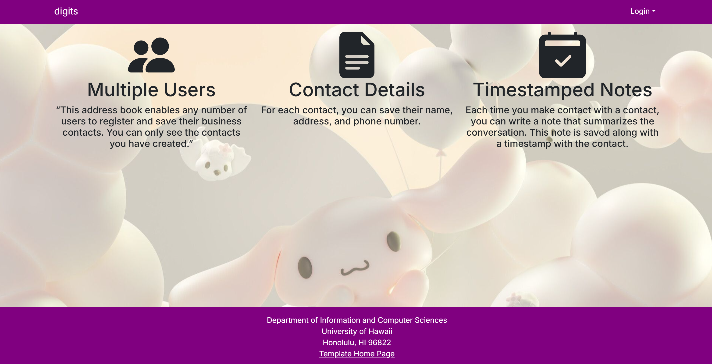

Digits is a Next.js 14 application that is designed to help manage personal contacts and user roles. This project demonstrates:

Landing Page
Greets the user and provides options to sign in or sign up.

Sign In / Sign Up
Users can log in with credentials seeded in settings.development.json

Admins can log in with admin@foo.com, users with john@foo.com

Home Page
Displays user-specific content after login.

Contacts Page
Shows a list of contacts associated with the logged-in user.

Allows editing and viewing of contact details.

Admin Features (if applicable)
Admins can manage users, view all contacts, or perform moderation tasks.

The goal of this template is to help you get quickly started doing Next.js development by providing a reasonable directory structure for development and deployment, a set of common extensions to the core framework, and boilerplate code to implement basic page display, navigation, forms, roles, and database manipulation.

To keep this codebase simple and small, some important capabilities are intentionally excluded from this template:

- Unit Testing
- Security
- Deployment

Examples of the these capabilities will be provided elsewhere.

## Installation
Installation
First, install PostgreSQL. Then create a database for your application.

ruby
Copy
Edit
$ createdb digits
Password:
$
Second, create a new GitHub repository for your Digits app. You can start from a template repository if available, or initialize a fresh repo and push your code there.

Third, go to your newly created repository, and clone it to your local file system. Using GitHub Desktop is a great choice if you use MacOS or Windows.

shell
Copy
Edit
$ git clone <your-repo-url>
$ cd digits
Fourth, install third party libraries:

ruby
Copy
Edit
$ npm install
Fifth, create a .env file from the sample .env or .env.example file. Set the DATABASE_URL variable to match your PostgreSQL database that you created in the first step. See the Prisma docs Connect your database.

Then run the Prisma migration npx prisma migrate dev to set up the PostgreSQL tables.

bash
Copy
Edit
$ npx prisma migrate dev
Environment variables loaded from .env
Prisma schema loaded from prisma/schema.prisma
Datasource "db": PostgreSQL database "<your database name>", schema "public" at "localhost:5432"

Applying migration `20240708195109_init`

The following migration(s) have been applied:

migrations/
└─ 20240708195109_init/
  └─ migration.sql

Your database is now in sync with your schema.

✔ Generated Prisma Client (v5.x.x) to ./node_modules/@prisma/client in XXms

$
Then seed the database with the /config/settings.development.json data using npx prisma db seed.

pgsql
Copy
Edit
$ npx prisma db seed
Environment variables loaded from .env
Running seed command `ts-node --compiler-options {"module":"CommonJS"} prisma/seed.ts` ...
Seeding the database
Creating user: admin@foo.com with role: ADMIN
Creating user: john@foo.com with role: USER

## Running the system
Once the libraries are installed and the database seeded, you can run the application by invoking the "dev" script in the package.json file:

markdown
Copy
Edit
$ npm run dev

> digits@0.1.0 dev
> next dev

▲ Next.js 14.x.x

- Local: http://localhost:3000
- Environments: .env

✓ Starting...
✓ Ready in XXXXms
Open your browser at http://localhost:3000 to view the running application.

<!--
## Screencasts

For more information about this system, please watch one or more of the following screencasts. Note that the current source code might differ slightly from the code in these screencasts, but the changes should be very minor.

- [Walkthrough of system user interface (6 min)](https://youtu.be/48xu1hrqUi8)
- [Data and accounts structure and initialization (18 min)](https://youtu.be/HZRjwrVBWp4)
- [Navigation, routing, pages, components (34 min)](https://youtu.be/XztTdHpv6Jw)
- [Forms (32 min)](https://youtu.be/8FyWR3gUGCM)
- [Authorization, authentication, and roles (12 min)](https://youtu.be/9HX5vuXTlvA)
-->
